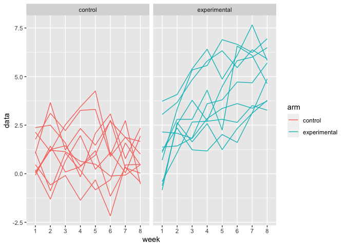

p8105_hw5_xt2288
================
Xiaoting Tang
2023-11-14

``` r
library(tidyverse)
```

    ## ── Attaching core tidyverse packages ──────────────────────── tidyverse 2.0.0 ──
    ## ✔ dplyr     1.1.3     ✔ readr     2.1.4
    ## ✔ forcats   1.0.0     ✔ stringr   1.5.0
    ## ✔ ggplot2   3.4.3     ✔ tibble    3.2.1
    ## ✔ lubridate 1.9.2     ✔ tidyr     1.3.0
    ## ✔ purrr     1.0.2     
    ## ── Conflicts ────────────────────────────────────────── tidyverse_conflicts() ──
    ## ✖ dplyr::filter() masks stats::filter()
    ## ✖ dplyr::lag()    masks stats::lag()
    ## ℹ Use the conflicted package (<http://conflicted.r-lib.org/>) to force all conflicts to become errors

``` r
set.seed(1)
```

# Problem 1

``` r
homicide_data_raw = read_csv("data/homicide-data.csv")
```

    ## Rows: 52179 Columns: 12
    ## ── Column specification ────────────────────────────────────────────────────────
    ## Delimiter: ","
    ## chr (9): uid, victim_last, victim_first, victim_race, victim_age, victim_sex...
    ## dbl (3): reported_date, lat, lon
    ## 
    ## ℹ Use `spec()` to retrieve the full column specification for this data.
    ## ℹ Specify the column types or set `show_col_types = FALSE` to quiet this message.

The raw data consist 12 variables and 52179 observations. Each
observation includes uid, reported date, victim first and last name,
race, age, sex, city, state, lat, lon, and disposition.

``` r
homicide_data = 
homicide_data_raw |>
  mutate(city_state = paste(city, state, sep=", "),
         disposition = case_match(
           disposition,
           "Closed by arrest" ~ "homicides",
           "Closed without arrest" ~ "unsolved homicides",
           "Open/No arrest" ~ "unsolved homicides"
         )) |>
  group_by(city_state, disposition) |>
  summarize(n = n()) |>
  filter(city_state != "Tulsa, AL") 
```

    ## `summarise()` has grouped output by 'city_state'. You can override using the
    ## `.groups` argument.

Tulsa, AL in city_state is removed, as it is not a major US city.

``` r
# prop.test
homicide_data_Bal = homicide_data |>
  pivot_wider(
    names_from = "disposition", 
    values_from = "n") |>
  filter(city_state == "Baltimore, MD")

prop_test_Bal = 
  prop.test(pull(homicide_data_Bal, `unsolved homicides`), 
            pull(homicide_data_Bal, homicides) + pull(homicide_data_Bal,`unsolved homicides`))

prop_test_Bal |>
  broom::tidy() |>
  select(estimate, conf.low, conf.high)
```

    ## # A tibble: 1 × 3
    ##   estimate conf.low conf.high
    ##      <dbl>    <dbl>     <dbl>
    ## 1    0.646    0.628     0.663

``` r
# prop.test for each city
homicide_data_prop = homicide_data |>
  pivot_wider(
    names_from = "disposition", 
    values_from = "n") |>
    filter(city_state != "Tulsa, AL") 

prop_test_city_state = function(a) {
    x = homicide_data_prop |>
      filter(city_state == a)
    
    test = prop.test(pull(x, `unsolved homicides`),
                     pull(x, homicides) + pull(x,`unsolved homicides`))
    test_result = test |>
      broom::tidy() |>
      select(estimate, conf.low, conf.high)
    
    test_result
}

test_res  = 
  data.frame(city_state = unique(pull(homicide_data_prop, city_state))) |>
  mutate(prop_test_res = purrr::map(city_state,prop_test_city_state)) |>
  unnest(cols = c(prop_test_res))
```

plot of the estimates and CIs for each city

``` r
test_res |>
  mutate(city_state = fct_reorder(city_state, estimate)) |>
  ggplot(aes(x = city_state, y = estimate)) +
  geom_point() +
  geom_errorbar(aes(ymin = conf.low, ymax = conf.high)) + 
  theme(axis.text.x = element_text(angle = 90, hjust = 1))
```

<!-- -->

The plot arrange the estimate of the proportion of unsolved homicides in
city,state. Chicago has the highest estimate and small range of
confidence interval.

# Problem 2

``` r
long_study = 
  data.frame(file_name = list.files("data/problem2data", full.names = TRUE)) |>
  mutate(obs = purrr::map(file_name, read_csv)) |>
  mutate(arm = list.files("data/problem2data"),
         subject_id = list.files("data/problem2data")) |>
  mutate(subject_id = gsub("\\D", "",  subject_id),
         arm = substr(arm, 1, 3),
         arm = 
           case_match(
             arm,
             "con" ~ "control",
             "exp" ~ "experimental"
           )) |>
  unnest(cols = c(obs)) |>
  relocate(arm, subject_id, everything()) |>
  select(-file_name) |>
  pivot_longer(
    week_1:week_8,
    names_to = "week", 
    values_to = "data"
  ) |>
  mutate(week = str_replace_all(week, "week_", ""))

long_study |>
  ggplot(aes(x = week, y = data, group = subject_id, color = arm)) + 
  geom_line() +
  facet_grid(~arm)
```

<!-- -->

The values of the subjects in the experimental group increase from week
1 to week 8. The values for the control group does not change much.

# Problem 3

``` r
n = 30
sigma = 5
mu = 0
alpha = 0.05

set.seed(1)


sim_mean = function(n, mu = mu, sigma = sigma) {
  sim_data = tibble(rnorm(n, mean = mu, sd = 5))
  
  result = t.test(sim_data, mu = 0, conf.level = 0.95)
  
  result |>
    broom::tidy() |>
    select(estimate, p.value)
}


output = vector("list", 5000)

for (i in 1:5000) {
  
  output[[i]] = sim_mean(n, 0, sigma)
}

sim_results_0 = bind_rows(output)
```

``` r
output = vector("list", 5000)
for (i in 1:5000) {output[[i]] = sim_mean(n, 1, sigma)}
sim_results_1 = bind_rows(output)
```

``` r
output = vector("list", 5000)
for (i in 1:5000) {output[[i]] = sim_mean(n, 2, sigma)}
sim_results_2 = bind_rows(output)
```

``` r
output = vector("list", 5000)
for (i in 1:5000) {output[[i]] = sim_mean(n, 3, sigma)}
sim_results_3 = bind_rows(output)
```

``` r
output = vector("list", 5000)
for (i in 1:5000) {output[[i]] = sim_mean(n, 4, sigma)}
sim_results_4 = bind_rows(output)
```

``` r
output = vector("list", 5000)
for (i in 1:5000) {output[[i]] = sim_mean(n, 5, sigma)}
sim_results_5 = bind_rows(output)
```

``` r
output = vector("list", 5000)
for (i in 1:5000) {output[[i]] = sim_mean(n, 6, sigma)}
sim_results_6 = bind_rows(output)
```

``` r
power_0 = sum(sim_results_0$p.value < 0.05)/5000
power_1 = sum(sim_results_1$p.value < 0.05)/5000
power_2 = sum(sim_results_2$p.value < 0.05)/5000
power_3 = sum(sim_results_3$p.value < 0.05)/5000
power_4 = sum(sim_results_4$p.value < 0.05)/5000
power_5 = sum(sim_results_5$p.value < 0.05)/5000
power_6 = sum(sim_results_6$p.value < 0.05)/5000

effect_size_power = 
  data.frame(power = c(power_0,power_1,power_2,power_3,power_4,power_5,power_6),
             effect_size = c(0,1,2,3,4,5,6))

effect_size_power |>
  ggplot(aes(x = effect_size, y = power)) +
  geom_point() +
  geom_line() +
  labs(title = "Power vs. Effect Size",
       x = "Effect Size",
       y = "Power")
```

<!-- -->

As the effect size increases, the power increases.

``` r
ave_est_0 = mean(sim_results_0$estimate)
ave_est_1 = mean(sim_results_1$estimate)
ave_est_2 = mean(sim_results_2$estimate)
ave_est_3 = mean(sim_results_3$estimate)
ave_est_4 = mean(sim_results_4$estimate)
ave_est_5 = mean(sim_results_5$estimate)
ave_est_6 = mean(sim_results_6$estimate)

ave_est_true = 
  data.frame(ave_est = c(ave_est_0,ave_est_1,ave_est_2,ave_est_3,ave_est_4,ave_est_5,ave_est_6),
             true_mu = c(0,1,2,3,4,5,6))

ave_est_true |>
  ggplot(aes(x = true_mu, y = ave_est)) +
  geom_point(color = "red") +
  geom_line(color = "red") +
  labs(title = "Average Estimate vs. True Mean",
       x = "True Mean",
       y = "Average Estimate") 
```

<!-- -->

``` r
ave_est_rej_0 = sim_results_0 |>
  filter(p.value < 0.05)

ave_est_rej_1 = sim_results_1 |>
  filter(p.value < 0.05)

ave_est_rej_2 = sim_results_2 |>
  filter(p.value < 0.05)

ave_est_rej_3 = sim_results_3 |>
  filter(p.value < 0.05)

ave_est_rej_4 = sim_results_4 |>
  filter(p.value < 0.05)

ave_est_rej_5 = sim_results_5 |>
  filter(p.value < 0.05)

ave_est_rej_6 = sim_results_6 |>
  filter(p.value < 0.05)

ave_est_rej_true = 
  data.frame(ave_est_rej = c(mean(ave_est_rej_0$estimate),
                         mean(ave_est_rej_1$estimate),
                         mean(ave_est_rej_2$estimate),
                         mean(ave_est_rej_3$estimate),
                         mean(ave_est_rej_4$estimate),
                         mean(ave_est_rej_5$estimate),
                         mean(ave_est_rej_6$estimate)),
             true_mu = c(0,1,2,3,4,5,6))

ggplot() +
  geom_point(data = ave_est_true, aes(x = true_mu, y = ave_est), color = "red") +
  geom_line(data = ave_est_true, aes(x = true_mu, y = ave_est), color = "red") +
  geom_point(data = ave_est_rej_true, aes(x = true_mu, y = ave_est_rej), color = "blue") +
  geom_line(data = ave_est_rej_true, aes(x = true_mu, y = ave_est_rej), color = "blue") +
  labs(title = "Average Estimate vs. True Mean",
       x = "True Mean",
       y = "Average Estimate") 
```

<!-- -->

The red line is average estimate vs. true mean. The average estimate is
very close to the true mean. The blue line is average estimate in which
the null was rejected vs true mean. The sample average for rejected null
is not approximately equal to the true value of mean when mean is 0,
1,2,3, and 4. It is because the power is not great enough. As the power
increases, or the effect size increases, the sample average estimate is
very close to the mean.
