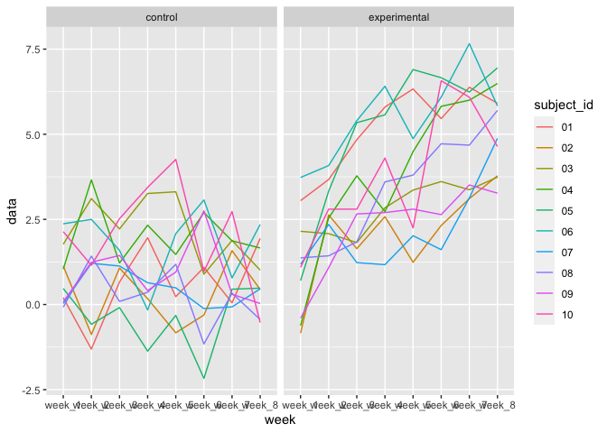

p8105_hw5_xt2288
================
Xiaoting Tang
2023-11-12

``` r
library(tidyverse)
```

    ## ── Attaching core tidyverse packages ──────────────────────── tidyverse 2.0.0 ──
    ## ✔ dplyr     1.1.3     ✔ readr     2.1.4
    ## ✔ forcats   1.0.0     ✔ stringr   1.5.0
    ## ✔ ggplot2   3.4.3     ✔ tibble    3.2.1
    ## ✔ lubridate 1.9.2     ✔ tidyr     1.3.0
    ## ✔ purrr     1.0.2     
    ## ── Conflicts ────────────────────────────────────────── tidyverse_conflicts() ──
    ## ✖ dplyr::filter() masks stats::filter()
    ## ✖ dplyr::lag()    masks stats::lag()
    ## ℹ Use the conflicted package (<http://conflicted.r-lib.org/>) to force all conflicts to become errors

# Problem 1

# Problem 2

``` r
long_study = 
  data.frame(file_name = list.files("data/problem2data", full.names = TRUE)) |>
  mutate(obs = purrr::map(file_name, read_csv)) |>
  mutate(arm_subject_id = list.files("data/problem2data"))|>
  mutate(arm_subject_id = gsub(".csv", "",  arm_subject_id)) |>
  unnest(cols = c(obs)) |>
  relocate(arm_subject_id, everything()) |>
  select(-file_name) |>
  pivot_longer(
    week_1:week_8,
    names_to = "week", 
    values_to = "data"
  )

long_study |>
  ggplot(aes(x = week, y = data, group = arm_subject_id, color = arm_subject_id)) + 
  geom_line()
```

<!-- -->
